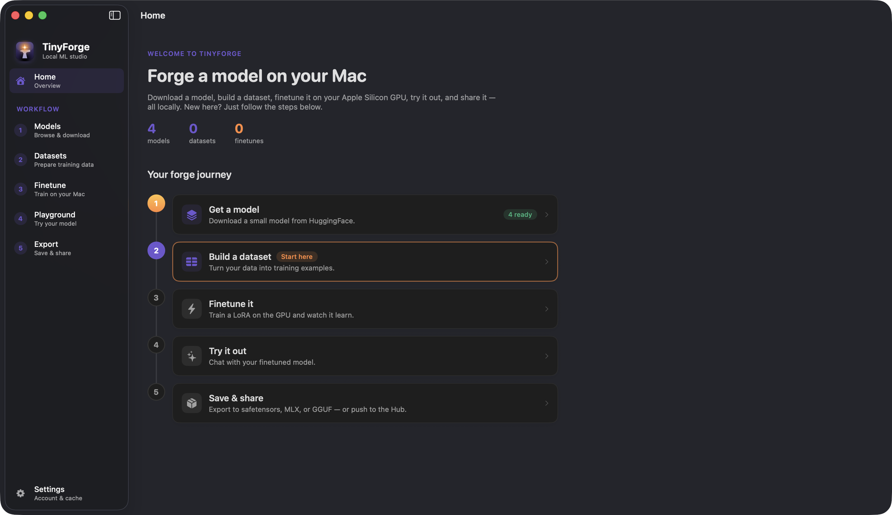
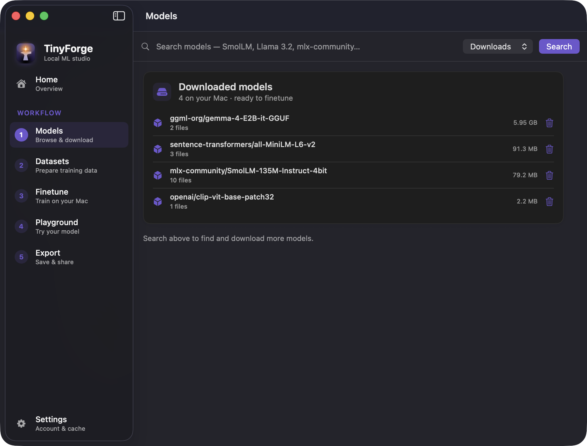
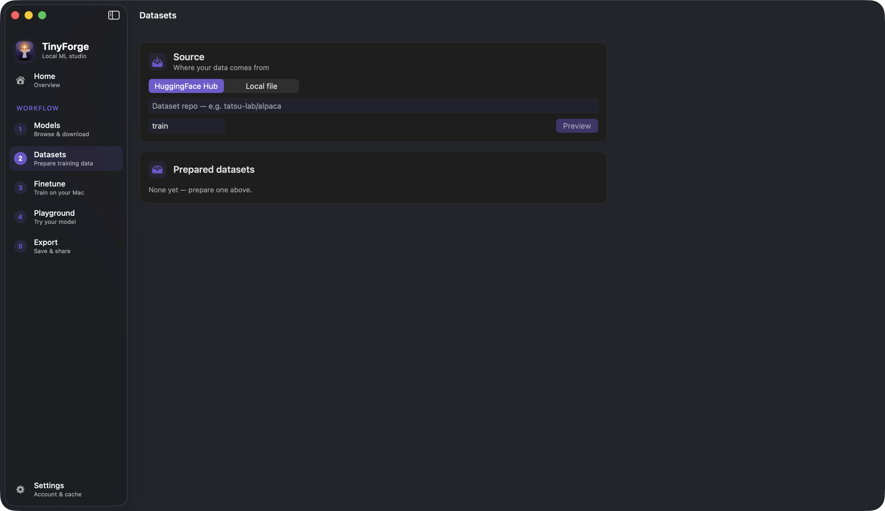
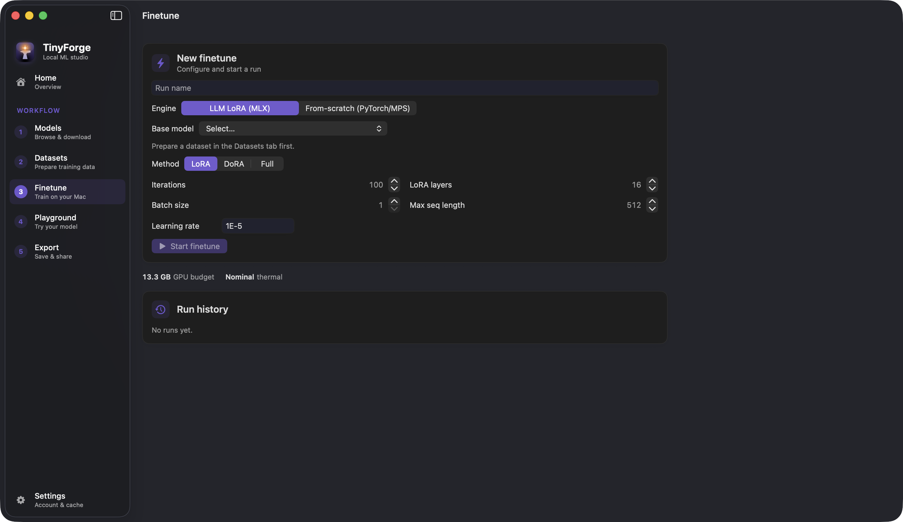
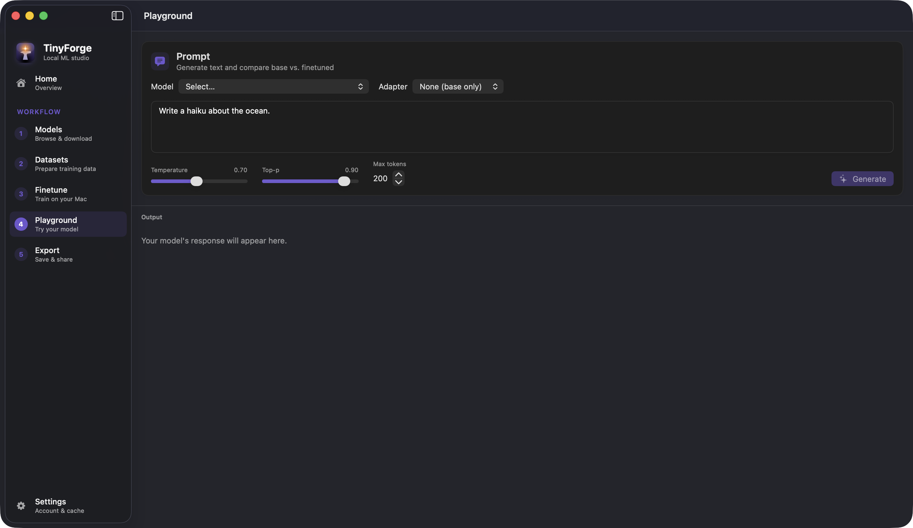

<div align="center">


# TinyForge

**Train, finetune, and experiment with tiny ML models — entirely on your Mac.**

A native macOS studio for the whole local ML loop: browse a model, build a dataset, finetune it on your Apple Silicon GPU, try it out, and export it — no cloud, no notebooks, no toolchain to set up.

[](#requirements)
[](https://swift.org)
[](https://python.org)
[](https://github.com/ml-explore/mlx)
[](https://github.com/skundu42/tinyforge/actions/workflows/ci.yml)
[](#testing)
[](LICENSE)



</div>

---

## Why TinyForge

Finetuning a small model on your own data shouldn't require a GPU rental, a stack of Python scripts, and three different CLIs. TinyForge wraps the best of the Apple Silicon ML ecosystem — **MLX**, **mlx-lm**, **PyTorch/MPS**, and the **HuggingFace** stack — behind a clean, native app that walks you through one coherent workflow:

> **Get a model → Build a dataset → Finetune → Try it out → Export & share**

Everything runs locally. Your data never leaves your machine.

## Features

- 🔍 **Model browser** — search HuggingFace, view files & READMEs, and download with a live progress bar (Xet-accelerated). See what you've already downloaded at a glance.
- 🧱 **Dataset builder** — import HuggingFace datasets or local JSON/CSV/Parquet, preview rows, map columns into chat / instruction / completion formats, inspect token-length distributions, and split into train/validation.
- ⚡ **Finetuning on the GPU** — LoRA / QLoRA / DoRA / full finetuning via **mlx-lm**, a from-scratch **PyTorch/MPS** engine, and a **vision** engine (ViT image classifier via HuggingFace Trainer) — all with **live dashboards** (loss, throughput, peak memory) and GPU/thermal telemetry.
- ✨ **Inference playground** — stream generations with sampling controls, compare **base vs. finetuned** side by side, and optionally run **natively in Swift** via MLX-Swift (no Python round-trip).
- 📦 **Export & share** — fuse adapters and export to **safetensors**, **MLX (quantized)**, **GGUF**, or **Core ML** (`.mlpackage`), and push straight to the Hub with an auto-generated model card.
- 🗂️ **Experiment tracking** — every run, dataset, and export is recorded locally (SQLite) and browsable.
- 📥 **Self-contained** — ships as a signed, notarizable `.app` with a bundled Python runtime. Nothing to install.

## Screenshots

<div align="center">
<table>
  <tr>
    <td><br/><sub><b>Models</b> — browse & manage downloads</sub></td>
    <td><br/><sub><b>Datasets</b> — build training data</sub></td>
  </tr>
  <tr>
    <td><br/><sub><b>Finetune</b> — configure & watch it train</sub></td>
    <td><br/><sub><b>Playground</b> — base vs. finetuned</sub></td>
  </tr>
</table>
</div>

## Requirements

- **Apple Silicon** Mac (M1 or later) — MLX and the MPS backend require it.
- **macOS 15+**.
- For development: **Xcode 26+**, [`xcodegen`](https://github.com/yonsm/XcodeGen), and [`uv`](https://github.com/astral-sh/uv). The first build downloads the **Metal Toolchain** (`xcodebuild -downloadComponent MetalToolchain`) for MLX-Swift's shaders.

## Quick start

### Run a release build

```bash
git clone github.com/skundu42/tinyforge && cd tinyforge
scripts/build_release.sh          # bundles Python, builds, signs → TinyForge.app
open build/Build/Products/Release/TinyForge.app
```

### Run from source (development)

```bash
# 1) Backend deps
cd backend && uv sync && cd ..

# 2) Generate the Xcode project and run
cd App && xcodegen generate && open TinyForge.xcodeproj   # then ⌘R
```

In a debug build, the app finds the dev Python environment automatically — no bundling needed.

## Tech stack

| Layer | Tools |
|-------|-------|
| **App** | SwiftUI · Swift 6.3 · Swift Charts · swift-subprocess · mlx-swift-lm · XcodeGen |
| **Backend** | FastAPI · uvicorn · pydantic · uv |
| **ML** | MLX · mlx-lm · PyTorch (MPS) · transformers · accelerate · datasets · coremltools |
| **Hub** | huggingface_hub (Xet) |
| **Packaging** | python-build-standalone · codesign · notarytool |

## Project structure

```
.
├── App/                  # SwiftUI macOS app (project.yml → Xcode project)
│   ├── Sources/
│   │   ├── Backend/      # process manager, API client, WebSocket clients
│   │   ├── DesignSystem/ # theme + reusable components
│   │   ├── Features/     # Home, Hub, Datasets, Training, Playground, Export, Settings
│   │   └── Telemetry/
│   └── Tests/
├── backend/              # Python orchestrator (uv project)
│   └── tinyforge/
│       ├── api/          # FastAPI app + routers
│       ├── hub/          # HuggingFace browse / download / cache / auth
│       ├── datasets/     # load / format / tokenize / registry
│       ├── train/        # mlx-lm & torch runners, orchestration, registry
│       ├── infer/        # streaming generation
│       └── export/       # fuse / convert / push
├── scripts/              # bundle_python, sign, notarize, package_dmg, build_release
└── docs/                 # roadmap, packaging guide, screenshots
```

## Testing

The project is built test-first. Logic is unit-tested with fakes; each milestone is verified end-to-end against the real toolchain (live HuggingFace, a real MLX finetune, a real MPS run, a real fuse, a bundled-runtime launch).

```bash
# Backend (114 tests)
cd backend && uv run pytest

# App (46 tests; -skipMacroValidation for the MLX-Swift macros)
cd App && xcodebuild test -scheme TinyForge -destination 'platform=macOS' -skipMacroValidation
```

Network/heavy end-to-end tests are opt-in: `touch .run-network-tests` to enable them.

## Contributing

Contributions are welcome! A good loop:

1. `cd backend && uv sync` and `cd App && xcodegen generate`.
2. Make your change **test-first** — add a failing test, then the code.
3. Run `uv run pytest` and `xcodebuild test` — keep them green.
4. Keep the design system (`App/Sources/DesignSystem`) consistent for any UI.
5. Open a PR with a clear description and, for UI work, a screenshot.

Found a bug or have an idea? Please open an issue.

## License

Released under the [MIT License](LICENSE). The TinyForge name and logo are part of this project; the bundled dependencies retain their own licenses.

## Acknowledgements

Built on the shoulders of [MLX](https://github.com/ml-explore/mlx) & [mlx-lm](https://github.com/ml-explore/mlx-lm), [PyTorch](https://pytorch.org), [HuggingFace](https://huggingface.co), [FastAPI](https://fastapi.tiangolo.com), and [uv](https://github.com/astral-sh/uv).

<div align="center"><sub>Forged on Apple Silicon. 🔨✨</sub></div>
